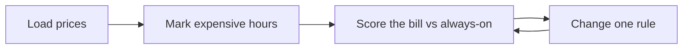

# Case 1 — When should we use electricity in Alberta?

**Stream:** Energy and Infrastructure Systems  
**Event:** IEEE YP Industry Hackathon  
**Dates:** October 2–4, 2026 | TBA (we will keep you informed), Calgary, AB

---

## The problem (in plain words)

In Alberta, the **pool price** is the wholesale price of electricity. It can be a few dollars one hour and hundreds of dollars the next.

If a factory, office, or City rec centre runs the same way every hour, it pays extra on the expensive hours. You do **not** need to model the whole grid. You need a simple rule: look at past prices, mark the expensive hours, and say **run now** or **wait**.

**Your challenge:** Read hourly prices. Make a plan for when to use power. Compare the bill to “always on.” Then **change the rule once** and show whether the bill got better.

---

## Who would use this

A City energy manager, a plant, or a retailer. You are selling **the same work, cheaper**, by shifting *when* it happens.

---

## Steps

1. Load the AESO price spreadsheet (a week you did not use to pick the rule).
2. Call an hour “expensive” in one sentence (example: the top 10% of prices).
3. For each hour: run, wait, or (optional) charge a small battery. You cannot charge and use the battery at the same time.
4. Score dollars vs always-on. Change one thing (the cutoff, or “never run 5–8 p.m.”) and score again.
5. Write three sentences: dollars saved, hours moved, when the rule would fail.

---

## Picture of the loop

**Always-on** means the machine never turns off. Your job is to beat that lazy plan.

---

## New words

| Word | Meaning |
|---|---|
| Pool price | Alberta’s hourly wholesale electricity price (dollars per megawatt-hour) |
| Baseline | The simple plan you must beat (here: always on) |
| AESO | The organization that runs Alberta’s power market |

---

## Watch or read (optional)

- [How Alberta’s electricity market works (AESO)](https://www.aeso.ca/aeso/understanding-electricity-in-alberta/)
- [What is a wholesale electricity market? (U.S. EIA, same idea)](https://www.eia.gov/energyexplained/electricity/electricity-in-the-us-generation-capacity-and-sales.php)

---

## How we score this case

| What we look for | Target |
|---|---|
| Cost vs always-on | Show dollars on the held-out week |
| Second plan | Also try a clock rule (e.g. never run 5–8 p.m.) |
| Loop | Change the rule at least once after you see the first score |

Full rubric: [JUDGING_RUBRIC.md](../../JUDGING_RUBRIC.md).

---

## Start here

1. Open a terminal **in this folder**.
2. `pip install -r requirements.txt`
3. `python agent_starter.py`
4. Change one number in the script and run it again.

Data notes: [`data/README.md`](data/README.md). **Python 3.10+** (3.11 is best).
