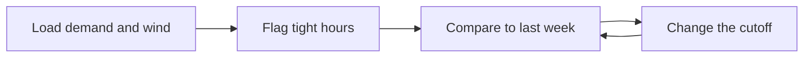

# Case 3 — When is Alberta short of wind?

**Stream:** Energy and Infrastructure Systems  
**Event:** IEEE YP Industry Hackathon  
**Dates:** October 2–4, 2026 | TBA (we will keep you informed), Calgary, AB

---

## The problem (in plain words)

Alberta has a lot of wind power. That is good — until a still, cold evening when people get home, the wind drops, and gas plants have to scramble. Prices often spike in those hours.

You are **not** running a full grid model. You are spotting **tight hours** from history: high demand and low wind.

**Your challenge:** Flag hours when load is high and wind is low. Beat “same hour last week” as a guess. Change what “tight” means once and show how many warnings you would have sent.

---

## Who would use this

A storage operator, a retailer, or a factory that can wait a few hours. You are selling a one-page **“tight evening” warning**.

---

## Steps

1. Load hourly demand (AIL) and wind from the AESO file.
2. Write a one-line score (example: demand in the top 20% **and** wind in the bottom 20%).
3. For a held-out week, mark tight / not tight.
4. Compare to last week’s same clock hour. Then loosen or tighten your cutoff.
5. Count hits, misses, and false alarms. Optional: check if tight hours were also expensive.

---

## Picture of the loop

**Precision** = of the hours you warned, how many were really tight.  
**Recall** = of the really tight hours, how many did you catch.

---

## New words

| Word | Meaning |
|---|---|
| AIL | Alberta Internal Load — how much power the province is using |
| Persistence | Guessing that this hour will look like the same hour last week |
| False alarm | You warned, but it was not actually a tight / expensive hour |

This case is a bit harder (precision and recall). Ask a mentor if those words are new.

---

## Watch or read (optional)

- [AESO — understanding electricity in Alberta](https://www.aeso.ca/aeso/understanding-electricity-in-alberta/)
- [Precision and recall (Wikipedia, short)](https://en.wikipedia.org/wiki/Precision_and_recall)

---

## How we score this case

| What we look for | Target |
|---|---|
| Baseline | Last week, same hour |
| Your flags | Precision/recall **or** expensive hours caught vs missed |
| Loop | Change the cutoff after you see false alarms |

Full rubric: [JUDGING_RUBRIC.md](../../JUDGING_RUBRIC.md).

---

## Start here

1. Open a terminal **in this folder**.
2. `pip install -r requirements.txt`
3. `python agent_starter.py`
4. Change the wind-share cutoff and run it again.

Data notes: [`data/README.md`](data/README.md). **Python 3.10+** (3.11 is best).
