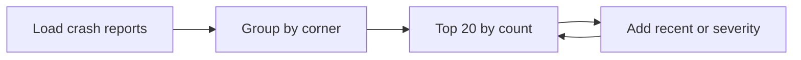

# Case 5 — Which Calgary intersections keep hurting people?

**Stream:** Energy and Infrastructure Systems  
**Event:** IEEE YP Industry Hackathon  
**Dates:** October 2–4, 2026 | TBA (we will keep you informed), Calgary, AB

---

## The problem (in plain words)

Some corners show up in crash reports again and again. Roads has a **limited safety budget**. If you only rank “most crashes,” you can miss a quieter intersection that is getting *worse*.

**Your challenge:** Make a **top 20** list for this year’s safety money. Beat a list that only counts total incidents. Change the score once (for example, give extra weight to recent crashes) and show how many of the top 20 stay the same.

You ranked locations. You did **not** reduce crashes.

---

## Who would use this

City of Calgary Roads / traffic safety. You are selling a **shortlist** so limited money hits the worst places first.

---

## Steps

1. Load traffic incidents. Drop rows with no location. Say how many you dropped.
2. Group by a location key you define (rounded lat/lon, or the incident text).
3. Count crashes. Add one extra signal (share that are recent, or severity if you have it).
4. Print top 20 vs count-only. Change weights; count overlap.
5. Explain three locations that rose or fell.

---

## Picture of the loop

---

## New words

| Word | Meaning |
|---|---|
| Hotspot | A place with many incidents |
| Overlap | How many locations appear on both top-20 lists |
| Baseline | Rank by count only |

---

## Watch or read (optional)

- [City of Calgary — traffic safety](https://www.calgary.ca/roads.html)
- [Open Calgary — Traffic Incidents](https://data.calgary.ca/Transportation-Transit/Traffic-Incidents/35ra-9556)

---

## How we score this case

| What we look for | Target |
|---|---|
| Baseline | Top 20 by count |
| Your list | Extra factor + overlap vs baseline |
| Loop | Re-weight at least once |
| Honesty | Ranking, not “we prevented crashes” |

Full rubric: [JUDGING_RUBRIC.md](../../JUDGING_RUBRIC.md).

---

## Start here

1. Open a terminal **in this folder**.
2. `pip install -r requirements.txt`
3. `python agent_starter.py`
4. Change the “recent” weight and run it again.

Data notes: [`data/README.md`](data/README.md). **Python 3.10+** (3.11 is best).
