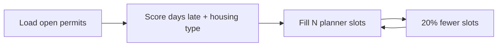

# Case 7 — Which housing permits should planners review next?

**Stream:** Energy and Infrastructure Systems  
**Event:** IEEE YP Industry Hackathon  
**Dates:** October 2–4, 2026 | InceptionU, Calgary

---

## The problem (in plain words)

Alberta had a record **54,858** housing starts in 2025. In Calgary’s **established** neighbourhoods, a development permit can still take about **100–186 days**. If the queue is “oldest first,” a small suite file and a multi-family building wait the same way.

Planners have only so many hours. Housing is infrastructure: if the queue is wrong, units do not get built.

**Your challenge:** Make a **this-week review list**. Beat oldest-first. Prefer housing (especially multi-family) and files already past a day target you write down. Then cut capacity by **20%** and rebuild the list.

You ranked files. You did **not** approve housing.

---

## Who would use this

City Planning & Development. You are selling **more housing-relevant decisions per planner-week**.

---

## Steps

1. Load the housing permit file. Keep files that are still in the queue (not Released / Cancelled).
2. Age = today minus applied date. Compare to a target (starter: 100 days in developing areas, 186 in established).
3. Weight multi-family higher. Fill `N` slots (starter: 50). Baseline = oldest `N`.
4. Drop to 80% of slots. Which files (and which neighbourhood type) dropped?
5. Write a file-manager paragraph.

---

## Picture of the loop

---

## New words

| Word | Meaning |
|---|---|
| Development permit (DP) | City approval before you can build or change a use |
| Established vs developing | Older neighbourhoods vs new suburbs (the City’s `srg` column) |
| FIFO | Oldest file first |

---

## Watch or read (optional)

- [City of Calgary — home building and development](https://www.calgary.ca/development/home-building.html)
- [Open Calgary — Development Permits](https://data.calgary.ca/Government/Development-Permits/6933-unw5)

---

## How we score this case

| What we look for | Target |
|---|---|
| Baseline | Oldest-first for the same `N` |
| Your list | More days-over-target **or** more multi-family than FIFO |
| Loop | One 20% capacity cut |

Full rubric: [JUDGING_RUBRIC.md](../../JUDGING_RUBRIC.md).

---

## Start here

1. Open a terminal **in this folder**.
2. `pip install -r requirements.txt`
3. `python agent_starter.py`
4. Change `N` or the day targets and run it again.

Data notes: [`data/README.md`](data/README.md). **Python 3.10+** (3.11 is best).
