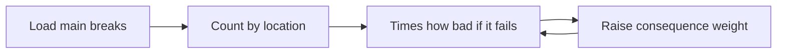
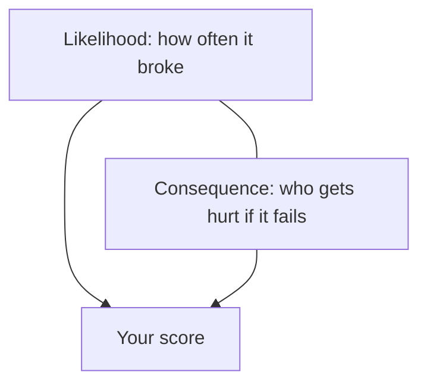

# Case 8 — Which water mains should we repair first?

**Stream:** Energy and Infrastructure Systems  
**Event:** IEEE YP Industry Hackathon  
**Dates:** October 2–4, 2026 | InceptionU, Calgary

---

## The problem (in plain words)

A **water main** is the buried pipe that brings drinking water down your street. Calgary’s Bearspaw South feedermain broke in **June 2024** and again in **December 2025**. The City had to limit water use.

The City’s own review said they used to rank pipes by **“how likely is a break?”** too much, and **“how bad if it breaks?”** too little. Counting “most breaks on this block” is the likelihood habit. A hospital neighbourhood or downtown is a different kind of miss.

This is **not** street lights and **not** car crashes. It is buried pipe.

**Your challenge:** Make a **top 25** repair / inspect list. Beat a ranking that only counts breaks. Then **raise the “how bad if it fails” weight** and show how the list moves.

You ranked historic clusters. You did **not** inspect the next Bearspaw pipe.

---

## Who would use this

City Water Services. You are selling a list so limited crews hit **high-consequence** pipe first, not only the noisiest block.

---

## Steps

1. Load the break points. Drop rows with no coordinates. Say how many.
2. Group by a location (rounded lat/lon, or community). Count breaks.
3. Multiply by the `consequence` column (`high` / `medium` / `low` — a lab label, explained in `data/README.md`).
4. Top 25 vs count-only. Increase the high-consequence weight; count overlap.
5. Explain three places that rose or fell.

`break_type` is a City code with **no public legend**. Count it or ignore it. Do not invent what A vs G means.

---

## Picture of the loop

---

## New words

| Word | Meaning |
|---|---|
| Likelihood | How often this spot has broken |
| Consequence | How bad it is if it breaks again (hospital, downtown, big feedermain corridor) |
| Feedermain | A large pipe that feeds many neighbourhoods |

---

## Watch or read (optional)

- [City of Calgary — water outages and main breaks](https://www.calgary.ca/water/water-utility/water-outages.html)
- [Open Calgary — Water Main Breaks](https://data.calgary.ca/Environment/Water-Main-Breaks/dpcu-jr23)
- [Risk = likelihood × consequence (simple overview)](https://en.wikipedia.org/wiki/Risk_matrix)

---

## How we score this case

| What we look for | Target |
|---|---|
| Baseline | Top 25 by break count |
| Your list | Count × consequence; overlap vs baseline |
| Loop | Heavier consequence weight at least once |

Full rubric: [JUDGING_RUBRIC.md](../../JUDGING_RUBRIC.md).

---

## Start here

1. Open a terminal **in this folder**.
2. `pip install -r requirements.txt`
3. `python agent_starter.py`
4. Change the high-consequence weight and run it again.

Data notes: [`data/README.md`](data/README.md). **Python 3.10+** (3.11 is best).
