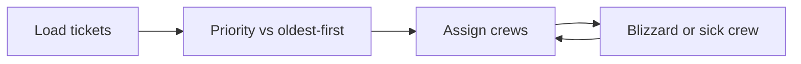

# Case 1 — Who should 311 send next?

**Stream:** Software and Computational Math  
**Event:** IEEE YP Industry Hackathon  
**Dates:** October 2–4, 2026 | InceptionU, Calgary

---

## The problem (in plain words)

Calgary 311 is a pile of potholes, ice, garbage, and signs. If every crew takes the **oldest** ticket, a safety problem sits behind a backlog of small complaints. Then a blizzard hits — or a crew calls in sick — and the 7 a.m. plan is wrong.

This is a tiny **job shop**: jobs (tickets), machines (crews), and one disruption.

**Your challenge:** Score open tickets and assign them to a few crews for one day. Beat oldest-first. Then apply **one** disruption (blizzard: ice/snow jumps, **or** one crew disappears) and **reassign**. Report how many jobs moved.

---

## Who would use this

311, Roads, or Waste & Recycling. You are selling **the right work done** when capacity drops.

---

## Steps

1. Load the 311 sample. Keep service type, community, date.
2. Give each ticket a priority (safety types higher). Assign up to `C` crews × `K` jobs each.
3. Baseline = oldest tickets first, ignore type.
4. Disruption. Replan. Count jobs that changed crew or dropped.
5. What you would tell the supervisor at 8 a.m. and at noon.

Keep geography simple (optional “same community” bonus). Full street routing is Case 2.

---

## Picture of the loop

**FIFO** = first in, first out = oldest ticket first.

---

## New words

| Word | Meaning |
|---|---|
| FIFO | Oldest request first |
| Dispatch | Matching jobs to crews |
| Disruption | Something that breaks the morning plan |

---

## Watch or read (optional)

- [Calgary 311](https://www.calgary.ca/311.html)
- [FIFO queues (Wikipedia)](https://en.wikipedia.org/wiki/FIFO_(computing_and_electronics))

---

## How we score this case

| What we look for | Target |
|---|---|
| Baseline | Oldest-first for the same crew capacity |
| Your plan | Higher priority points, or better safety-type coverage |
| Loop | One disruption; % of jobs that moved |
| Size | A sample of tickets (about 80–200), not all of 311 history |

Full rubric: [JUDGING_RUBRIC.md](../../JUDGING_RUBRIC.md).

---

## Start here

1. Open a terminal **in this folder**.
2. `pip install -r requirements.txt`
3. `python agent_starter.py`
4. Change crew count or the disruption and run it again.

Data notes: [`data/README.md`](data/README.md). **Python 3.10+** (3.11 is best).
