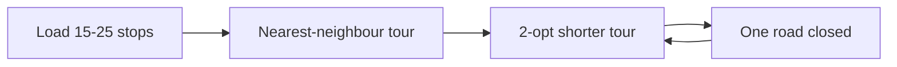

# Case 2 — In what order should we plow or deliver?

**Stream:** Software and Computational Math  
**Event:** IEEE YP Industry Hackathon  
**Dates:** October 2–4, 2026 | InceptionU, Calgary

---

## The problem (in plain words)

After a storm, Calgary cannot treat every street at once. Snow control has **priority routes**. The same math is a courier with 20 stops: you need a short tour, then you need to **change it** when a road closes.

You will not solve the whole plow network. You will route **about 15–25 stops**.

**Your challenge:** Build a tour. Beat nearest-neighbour (always go to the closest leftover stop). Improve it once (swap two stops). Then drop a blocked stop and show the new distance.

---

## Who would use this

Roads snow planners, or a local delivery firm. You are selling **fewer kilometres** and a plan that can change.

---

## Steps

1. Load 15–25 Calgary points. Distance = haversine km (straight-line on the globe — good enough).
2. Nearest-neighbour from a depot (downtown in the seed).
3. Improve with **2-opt** (the starter does this) or a pairwise swap. Report km before and after.
4. Remove one stop (“road closed”) and rebuild.
5. Ordered list or a simple map sketch; km saved vs nearest-neighbour.

---

## Picture of the loop

Nearest-neighbour is greedy: always the closest next stop. It is fast and often not the shortest.

---

## New words

| Word | Meaning |
|---|---|
| Tour | A loop that visits each stop and returns to the depot |
| Nearest-neighbour | Always go to the closest stop you have not visited |
| 2-opt | Untwist two edges of the tour to make it shorter |
| Haversine | A formula for km between two lat/lon points |

---

## Watch or read (optional)

- [Travelling salesman problem (Wikipedia, with pictures)](https://en.wikipedia.org/wiki/Travelling_salesman_problem)
- [Nearest-neighbour tour (Wikipedia)](https://en.wikipedia.org/wiki/Nearest_neighbour_algorithm)
- [City of Calgary — snow and ice](https://www.calgary.ca/roads/conditions/snow-ice-salt.html)
- Picture-heavy overview: stay on the Wikipedia TSP page above (the maps at the top of the article are enough)

---

## How we score this case

| What we look for | Target |
|---|---|
| Baseline | Nearest-neighbour from a stated depot |
| Improvement | Lower km after 2-opt/swap |
| Disruption | One closed or extra stop; new tour |
| Loop | At least one improve **and** one disruption |

Full rubric: [JUDGING_RUBRIC.md](../../JUDGING_RUBRIC.md).

---

## Start here

1. Open a terminal **in this folder**.
2. `pip install -r requirements.txt`
3. `python agent_starter.py`
4. Close a different stop and run it again.

Data notes: [`data/README.md`](data/README.md). **Python 3.10+** (3.11 is best).
