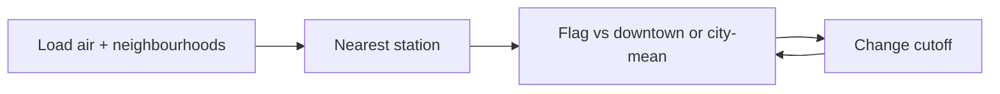

# Case 4 — Which neighbourhoods get a smoke or hail flag?

**Stream:** Software and Computational Math  
**Event:** IEEE YP Industry Hackathon  
**Dates:** October 2–4, 2026 | InceptionU, Calgary

---

## The problem (in plain words)

Bad weather is not the same in every neighbourhood. The **5 August 2024** hailstorm was about **$3.3 billion** and **~130,000** insurance claims — mostly a north / airport corridor, not “the whole city.” Smoke is the other flag: a few stations measure air, and someone still has to say **which communities** get a notice.

There is no public hail-claims spreadsheet by neighbourhood. The hail column in this pack is a **practice label** from news about that storm path, not insurance data.

**Your challenge:** Flag neighbourhoods for **smoke**, **hail**, or both. Beat a lazy rule (downtown only, or “city average is smoky → flag everyone”). Then change the air cutoff or the hail weight and show which communities flip.

---

## Who would use this

Emergency Management, 311, or a school-board ops lead. You are selling a **short flagged list** when risk is not city-wide.

---

## Steps

1. Load air readings and the neighbourhood table. Use AQHI and/or fine particles (PM2.5).
2. Give each community the **nearest station** (straight-line km is enough).
3. Combine air score with `hail_track` (`high` / `medium` / `low`). Write the flag rule in one line.
4. Compare to downtown-only or “flag everyone if the city mean is high.”
5. Change the cutoff; count flips. Ten lines a supervisor could read.

---

## Picture of the loop

**AQHI** is Canada’s Air Quality Health Index (roughly 1 = low risk, 7+ = high). A station is a sensor, not a neighbourhood.

---

## New words

| Word | Meaning |
|---|---|
| AQHI | Air Quality Health Index |
| PM2.5 | Tiny particles in smoke and exhaust |
| Hail track | In this lab: high / medium / low along the Aug 2024 north-city path (a scenario, not insurance data) |

---

## Watch or read (optional)

- [Air Quality Health Index (Government of Canada)](https://www.canada.ca/en/environment-climate-change/services/air-quality-health-index.html)
- [How the AQHI is calculated (Canada.ca)](https://www.canada.ca/en/environment-climate-change/services/air-quality-health-index/about.html)
- [Open Calgary — air quality](https://data.calgary.ca/Environment/Air-Quality-Data-near-real-time-/g9s5-qhu5)

---

## How we score this case

| What we look for | Target |
|---|---|
| Baseline | Downtown-only **or** citywide-mean rule |
| Your list | Local station air **plus** hail track |
| Loop | One cutoff/weight change; count flips |
| Honesty | Hail labels are a scenario, not claim totals |

Full rubric: [JUDGING_RUBRIC.md](../../JUDGING_RUBRIC.md).

---

## Start here

1. Open a terminal **in this folder**.
2. `pip install -r requirements.txt`
3. `python agent_starter.py`
4. Change the AQHI cutoff and run it again.

Data notes: [`data/README.md`](data/README.md). **Python 3.10+** (3.11 is best).
