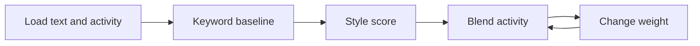

# Case 5 — Is this account a teen? (No birthday, no camera.)

**Stream:** Software and Computational Math  
**Event:** IEEE YP Industry Hackathon  
**Dates:** October 2–4, 2026 | InceptionU, Calgary

---

## The problem (in plain words)

In August 2026, Meta (Facebook / Instagram) agreed to a major U.S. state settlement about kids and teens on its apps. Part of that deal: Meta must get better at spotting **underage and teen accounts** — including accounts where someone **lied about their birthday**.

Kids can type “I’m 25.” A camera selfie is one option Meta uses in other products, but it is **not** allowed for this case. Meta’s own engineers already talk about a different approach: look at **what people write** and **how they use the app** (when they log in, how long they stay, what they watch). Google does something similar for YouTube watch history.

**Your challenge:** You are the Meta software engineer. For each account, decide **teen (13–17)** vs **adult (23+)**. You may use writing style and activity patterns. You may **not** use the typed birthday or any photo/camera signal. Beat a lazy keyword rule. Then **blend in activity** once and show how many teens you catch vs how many adults you wrongly lock into a teen experience.

This estimates likelihood. It does **not** verify a real legal age — the same limit Meta itself describes for AI age assurance.

---

## Who would use this

A trust-and-safety / age-assurance team at Meta, YouTube, TikTok, or any app store that must put teens into safer defaults. You are selling a **ranked “likely teen” list** and a false-teen / missed-teen trade-off, not a courtroom ID check.

---

## Steps

1. Load `teen_adult_joined.csv` (one row per account: text features + activity features + `label_teen`).
2. Baseline: flag teen if school/birthday keywords appear in their posts (`keyword_teen_flag`).
3. Build a simple writing-style score (word length, first-person rate, slang, etc.). Pick a cutoff.
4. Blend that score with activity signals (evening use, school-hour quiet time, short-video share, night notification opens).
5. Change the blend weight or cutoff once. Report **precision**, **recall**, **false-teen rate**, and **missed-teen rate**.

Optional stretch: train a logistic regression on the same columns (still no birthday, no images).

---

## Picture of the loop

**Precision** = of the accounts you called teen, how many really were.  
**Recall** = of the real teens, how many you caught.  
Locking an adult into a teen experience is a **false teen**. Missing a real teen is a **missed teen**.

---

## New words

| Word | Meaning |
|---|---|
| Age assurance | Guessing or checking whether someone is a child, teen, or adult |
| Soft signal | A clue (login time, word choice) that is not a government ID |
| Stylometry | Measuring writing style with numbers (word length, slang rate, …) |
| False teen | You said teen, but the label says adult |
| Missed teen | You said adult, but the label says teen |

This case is a bit harder than a pure ranking list (you need precision and recall). Ask a mentor if those words are new.

---

## Watch or read (optional)

- [Reuters — how Meta’s 2026 age settlement is supposed to work](https://www.reuters.com/legal/government/settlement-requires-meta-check-young-users-ages-how-will-that-work-2026-08-31/)
- [Meta — how its adult classifier uses profile and interaction signals (2022)](https://tech.facebook.com/artificial-intelligence/2022/6/adult-classifier/)
- [Meta — AI age assurance for teens (2026)](https://about.fb.com/news/2026/05/ai-age-assurance-teens/)
- [PBS — platforms estimating age from activity, not just birthdays](https://www.pbs.org/newshour/nation/amid-legal-battles-social-media-companies-are-trying-harder-to-know-which-users-are-kids)
- Blog Authorship Corpus paper: Schler, Koppel, Argamon & Pennebaker (2006)

---

## How we score this case

| What we look for | Target |
|---|---|
| Baseline | Keyword / “mentions school” rule |
| Your model | Writing style **and/or** activity features |
| Loop | Change a cutoff or blend weight once; show precision/recall |
| Honesty | Text is 2004 blogs; activity columns are synthetic practice data |

Full rubric: [JUDGING_RUBRIC.md](../../JUDGING_RUBRIC.md).

---

## Start here

1. Open a terminal **in this folder** (on Windows, quote the path).
2. `pip install -r requirements.txt`
3. `python agent_starter.py`
4. Change the activity blend weight (or the style cutoff) and run it again.

Data notes: [`data/README.md`](data/README.md). Larger optional files: [GitHub Release zip](https://github.com/nagusubra/industry-hackathon-lab/releases/download/case5-teen-adult-data/ieee-yp-hackathon-2026-case5-teen-adult.zip). **Python 3.10+** (3.11 is best).
