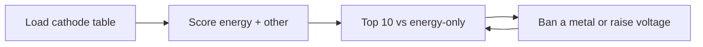

# Case 1 — Which battery material is good enough for Alberta storage?

**Stream:** Chemical Systems and Material Science  
**Event:** IEEE YP Industry Hackathon  
**Dates:** October 2–4, 2026 | TBA (we will keep you informed), Calgary, AB

---

## The problem (in plain words)

Alberta is adding **grid batteries** so wind and solar can be stored when the pool price is low. Teams still have to pick a **cathode** (the positive side of a lithium-ion cell): high energy is good; unstable or rare-metal recipes are not.

You will not call a materials website and you will not run a lab. You will use a **table of already-computed properties** and make a shortlist a storage developer can argue about.

**Your challenge:** Output a **top 10**. Beat “sort by energy only.” Then change one filter (minimum voltage, or ban a metal like cobalt) and show how the top 10 changes.

These are table values, not cells you built in a lab.

---

## Who would use this

A storage developer doing a first pass. You are selling a **transparent shortlist**, not a magic “best battery.”

---

## Steps

1. Load the electrode table. Drop incomplete rows.
2. Score with at least two ideas (energy **and** a penalty for listed metals or big volume change). One-line formula.
3. Top 10 vs energy-only.
4. Raise minimum voltage **or** drop Co/Ni formulas; re-rank.
5. What you would tell a chemist vs a project financier.

---

## Picture of the loop

A **cathode** is one electrode in a rechargeable battery. Higher energy density means more stored energy for the same weight.

---

## New words

| Word | Meaning |
|---|---|
| Cathode | The positive electrode in this table |
| Energy density | Watt-hours per kilogram — more is more storage per kg |
| Critical element | A metal that is expensive or hard to source (example: cobalt) |

---

## Watch or read (optional)

- [Lithium-ion battery (Wikipedia, start at “Electrodes”)](https://en.wikipedia.org/wiki/Lithium-ion_battery)
- Short video: [What’s inside a lithium-ion battery? (Veritasium)](https://www.youtube.com/watch?v=AGglJehON5g)

---

## How we score this case

| What we look for | Target |
|---|---|
| Baseline | Top 10 by energy (or capacity) alone |
| Your list | Overlap vs baseline + why new names appeared |
| Loop | One filter or weight change |
| Honesty | Database / literature values, not a lab cell |

Full rubric: [JUDGING_RUBRIC.md](../../JUDGING_RUBRIC.md).

---

## Start here

1. Open a terminal **in this folder**.
2. `pip install -r requirements.txt`
3. `python agent_starter.py`
4. Drop a different metal or change the score and run it again.

**No API key.** Data notes: [`data/README.md`](data/README.md). **Python 3.10+** (3.11 is best).
