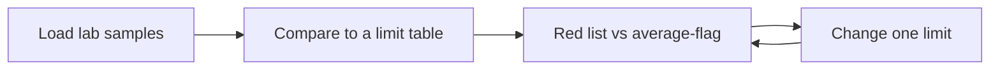

# Case 2 — Is the Bow or Elbow over the limit today?

**Stream:** Chemical Systems and Material Science  
**Event:** IEEE YP Industry Hackathon  
**Dates:** October 2–4, 2026 | TBA (we will keep you informed), Calgary, AB

---

## The problem (in plain words)

Calgary drinks from the **Bow** and **Elbow** rivers. The City already sends samples to a lab. The remaining job is simple and high-stakes: **is this number over the limit, and which site should we sample again?**

You are not inventing new chemistry. You compare lab results to a **small table of limits** and make a red / yellow / green list.

**Your challenge:** Flag samples over a guideline. Beat “flag anything above the average” (that rule is noisy). Then **tighten or loosen one limit** and show how the red list changes.

Do **not** recommend dumping chemicals or “treating the river.” Stay on **monitor and resample**.

---

## Who would use this

City water-quality staff. You are selling **fewer missed exceedances** and a Monday-morning list.

---

## Steps

1. Load sample rows (site, date, parameter, value). Drop rows you cannot read.
2. Join to `limits.csv`. Flag over / near / under.
3. Baseline = flag if value > the average for that parameter (show that this is a weak rule).
4. Change one limit (the starter tightens phosphorus). Re-flag.
5. Which sites would you resample this week, and why?

---

## Picture of the loop

A **limit** is a number from a guideline (example: phosphorus should stay below X). An **exceedance** means the sample is over that number.

---

## New words

| Word | Meaning |
|---|---|
| Parameter | What was measured (phosphorus, pH, …) |
| Exceedance | The value is past the limit |
| Baseline | Flag if above the average — usually too many false alarms |

---

## Watch or read (optional)

- [Canadian water quality guidelines (CCME)](https://ccme.ca/en/current-activities/canadian-environmental-quality-guidelines)
- [City of Calgary — drinking water](https://www.calgary.ca/water/drinking-water.html)

---

## How we score this case

| What we look for | Target |
|---|---|
| Baseline | Flag > mean (show why it is weak) |
| Your flags | Count vs baseline; list of sites |
| Loop | One limit change |
| Safety | Resample / monitor only |

Full rubric: [JUDGING_RUBRIC.md](../../JUDGING_RUBRIC.md).

---

## Start here

1. Open a terminal **in this folder**.
2. `pip install -r requirements.txt`
3. `python agent_starter.py`
4. Change one number in `limits.csv` or the script and run it again.

Data notes: [`data/README.md`](data/README.md). **Python 3.10+** (3.11 is best).
