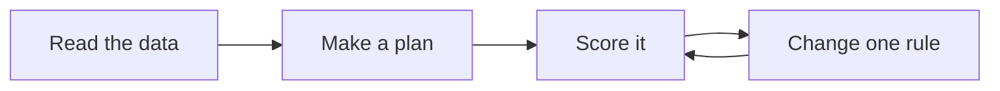
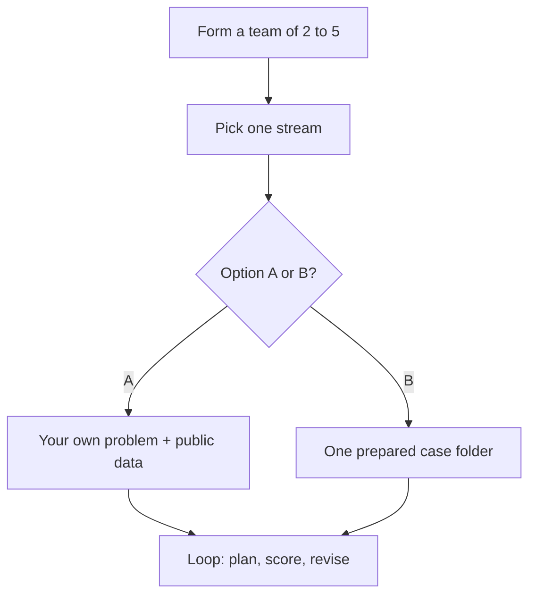

# IEEE YP Industry Hackathon: Autonomous Intelligence for Industrial Innovation

[](https://nagusubra.github.io/traffic/doc/metric/industry-hackathon-lab/)

**Hosted by:** IEEE Southern Alberta Section Young Professionals (IEEE SAS YP)  
**Dates:** Friday, October 2 – Sunday, October 4, 2026  
**Duration:** 48-hour hackathon  
**Location:** InceptionU, Calgary, Alberta  
**Website:** [southern-alberta.ieeecanada.org](https://southern-alberta.ieeecanada.org/)

---

## Partners

| Partner | Role | Link |
|---|---|---|
| **IEEE** | Host / Organizer | [southern-alberta.ieeecanada.org](https://southern-alberta.ieeecanada.org/) |
| **TechConnect Alberta** | Ecosystem partner | [techconnect.amgfoundation.ca](https://techconnect.amgfoundation.ca/) |
| **Eudaimonia** | Community volunteers | [luma.com/eudaimonia](https://luma.com/eudaimonia) |
| **Young Energy Infrastructure Professionals** | Community partner | [yeip.energy](https://yeip.energy/) |
| **Cursor** | AI coding partner | [cursor.com/home](https://cursor.com/home) |

---

## Mission

Build something a **real operator in Calgary, Alberta, or Canadian industry** could use: a ranked list, a schedule, a flag, or a mix — with public data and a number you can defend. Not a chatbot wrapper.

You spend 48 hours on a small **decision loop**:



Cursor (or another AI coding tool) is allowed so the hard part is the **industrial problem**, not the boilerplate.

Open to **high school students through industry professionals**. One common prize track. Every prepared case is written so a high-school team can start; a few cases (wind flags, remaining life) are a bit harder — that is marked in the case README.

---

## Event Schedule (MST)

| Phase / Event | Date & Time (MST) | Notes |
|---|---|---|
| Official Kickoff | Friday, Oct 2 @ 5:00 PM | Opening remarks, track briefing, team formation |
| Submissions Close | Sunday, Oct 4 @ 12:00 PM | Teams submit projects, GitHub links & video demos |
| Judging Window (Active) | Sunday, Oct 4 @ 1:00 PM – 4:00 PM | Mandatory scoring & deliberation |
| Winners Announced | Sunday, Oct 4 @ 4:00 PM | Judges present awards |
| Hackathon Wrap-up | Sunday, Oct 4 @ 5:00 PM | Closing remarks and networking |

---

## Eligibility & Teams

- **Eligibility:** Open to all — high school students, university students, professionals, IEEE members, and non-members.
- **Team size:** Collaborative teams of **2 to 5 members**.
- **Format:** In-person, 48-hour build sprint at InceptionU.

---

## Prizes

| Place | Prize (CAD) |
|---|---|
| 1st Place | $200 |
| 2nd Place | $150 |
| 3rd Place | $100 |

---

## Judges & Sponsors

Judges & Sponsors: **to be announced**.

If you have any suggestions or would like to become a sponsor for the hackathon, please contact the Chair (below).

---

## Registration & Contact

- **Registration:** `[REGISTRATION LINK - TBD]`
- **Contact / Sponsorship:** Subramanian Narayanan, IEEE SAS YP Chair — [nagusubra@ieee.org](mailto:nagusubra@ieee.org)

---

## How to participate (pick a stream, then a path)



**Step 1 — Form a team of 2–5 and choose exactly one industrial stream** (the three themes below).

**Step 2 — Choose Option A or Option B.**

### Option A — Bring your own problem

Find your own problem statement and public dataset, build a solution, and present it to the judges. Stay inside your stream's theme. You are scored on the **same rubric** as prepared cases.

Your project must:

1. Fit the **stream theme** (one-liners below).
2. Use a **real public dataset** (prefer [Open Calgary](https://data.calgary.ca/), [AESO](https://www.aeso.ca/market/market-and-system-reporting/data-requests/), Alberta Open Government, ECCC, CER, or Statistics Canada). Cite the source.
3. Beat a **named naive baseline** (the lazy plan: yesterday’s value, random, always-on, nearest-neighbour, oldest-first, or majority class).
4. Run **at least one plan → score → change the plan** cycle in **code** (not a single chat answer).
5. Name **who would use it** (a City business unit, AESO, a retailer, a plant, a contractor).

### Option B — Pick a prepared case

Choose **one** case from your stream's folder. Follow that case `README.md` and `data/README.md`.

---

## Judging

Projects are scored out of **100 points**. See [JUDGING_RUBRIC.md](JUDGING_RUBRIC.md). Option A and Option B use the same criteria.

**Required submission package (by Sunday, Oct 4 @ 12:00 PM MST):**

1. GitHub repository link
2. Project details / documentation
3. Working demo video link

---

## Industrial Streams

### 1. Energy and Infrastructure Systems

**Theme:** Alberta power is cheap some hours and very expensive in others. Calgary also has to decide **which building, road, light, water main, or permit file to fix first**.

| Case | Title |
|---|---|
| 1 | [When should we use electricity in Alberta?](01-energy-and-infrastructure-systems/Case%201%20-%20Autonomous%20Alberta%20Peak-Price%20Load-Shift%20Agent/README.md) |
| 2 | [Which Calgary buildings should we retrofit first?](01-energy-and-infrastructure-systems/Case%202%20-%20Autonomous%20Calgary%20Building%20Retrofit-Prioritization%20Agent/README.md) |
| 3 | [When is Alberta short of wind?](01-energy-and-infrastructure-systems/Case%203%20-%20Autonomous%20Alberta%20Wind-and-Demand%20Balancing%20Agent/README.md) |
| 4 | [How many more trips can this engine make?](01-energy-and-infrastructure-systems/Case%204%20-%20Autonomous%20Transit-Fleet%20Remaining-Life%20Agent/README.md) |
| 5 | [Which Calgary intersections keep hurting people?](01-energy-and-infrastructure-systems/Case%205%20-%20Autonomous%20Calgary%20Collision-Hotspot%20Ranking%20Agent/README.md) |
| 6 | [Which street lights should we fix this week?](01-energy-and-infrastructure-systems/Case%206%20-%20Autonomous%20Street-Light%20Outage%20Dispatch%20Agent/README.md) |
| 7 | [Which housing permits should planners review next?](01-energy-and-infrastructure-systems/Case%207%20-%20Autonomous%20Calgary%20Development-Permit%20Triage%20Agent/README.md) |
| 8 | [Which water mains should we repair first?](01-energy-and-infrastructure-systems/Case%208%20-%20Autonomous%20Calgary%20Water-Main%20Repair-Ranking%20Agent/README.md) |

Option A examples: AESO pool price vs a City facility; [Corporate Energy Consumption](https://data.calgary.ca/Environment/Corporate-Energy-Consumption/crbp-innf); [Traffic Incidents](https://data.calgary.ca/Transportation-Transit/Traffic-Incidents/35ra-9556); [Traffic Volumes](https://data.calgary.ca/dataset/Traffic-Volumes-for-2024/cauu-7hnw); [Development Permits](https://data.calgary.ca/Government/Development-Permits/6933-unw5); [Water Main Breaks](https://data.calgary.ca/Environment/Water-Main-Breaks/dpcu-jr23).

### 2. Software and Computational Math

**Theme:** Too few crews, trucks, and hours — including **hail, smoke, wildfire, and age-assurance flags**. Build a **schedule, dispatch list, flag list, route, or teen/adult classifier** that still works when a truck breaks, a storm hits, or someone lies about their birthday.

| Case | Title |
|---|---|
| 1 | [Who should 311 send next?](02-software-and-computational-math/Case%201%20-%20Autonomous%20311%20Work-Order%20Dispatch%20Agent/README.md) |
| 2 | [In what order should we plow or deliver?](02-software-and-computational-math/Case%202%20-%20Autonomous%20Calgary%20Snow-and-Delivery%20Routing%20Agent/README.md) |
| 3 | [Which wildfires get the next crew?](02-software-and-computational-math/Case%203%20-%20Autonomous%20Alberta%20Wildfire%20Crew-Ranking%20Agent/README.md) |
| 4 | [Which neighbourhoods get a smoke or hail flag?](02-software-and-computational-math/Case%204%20-%20Autonomous%20Neighbourhood%20Smoke-and-Hail%20Flag%20Agent/README.md) |
| 5 | [Is this account a teen? (No birthday, no camera.)](02-software-and-computational-math/Case%205%20-%20Autonomous%20Teen-vs-Adult%20Behavior%20Signal%20Agent/README.md) |

Option A examples: Calgary Transit GTFS as a *small* subset of stops; waste-collection routing; a tiny factory job-shop CSV you publish with the repo; [Open Calgary air quality](https://data.calgary.ca/Environment/Air-Quality-Data-near-real-time-/g9s5-qhu5); Alberta historical wildfire CSV (2006–2025) if you want a different fire or smoke cut than Case 3–4; [Blog Authorship Corpus](https://huggingface.co/datasets/barilan/blog_authorship_corpus) for a larger writing-style age task than Case 5.

### 3. Chemical Systems and Material Science

**Theme:** Pick a mix, metal, or water sample that is strong enough, clean enough, and cheap enough — **against a number** (strength, voltage, or a legal limit).

| Case | Title |
|---|---|
| 1 | [Which battery material is good enough for Alberta storage?](03-chemical-systems-and-material-science/Case%201%20-%20Autonomous%20Alberta%20Storage%20Cathode%20Shortlist%20Agent/README.md) |
| 2 | [Is the Bow or Elbow over the limit today?](03-chemical-systems-and-material-science/Case%202%20-%20Autonomous%20Bow-Elbow%20Water-Quality%20Flag%20Agent/README.md) |

Option A examples: City Roads concrete / paving mix tables; Alberta waste-diversion tonnes; industrial air-emission rates from [Alberta AEIR](https://open.alberta.ca/opendata/aeirairemissionrates).

---

## Repository Layout

```
industry-hackathon-lab/
├── README.md
├── LICENSE
├── JUDGING_RUBRIC.md
├── 01-energy-and-infrastructure-systems/
├── 02-software-and-computational-math/
└── 03-chemical-systems-and-material-science/
```

Each prepared case includes a plain-language brief (`README.md` with a flowchart), a seed CSV in `data/`, `agent_starter.py`, and `requirements.txt`. **Open the case folder first**, then install and run.

---

## Getting Started

**Requires Python 3.10+ (3.11 recommended).** You may use Cursor or another AI coding tool.

1. Register via the registration link above (when published).
2. Form a team of 2–5 and pick **one** stream.
3. Choose **Option A** (your problem) or **Option B** (one prepared case).
4. Clone this lab. For Option B, **cd into the case folder**, then:

   ```bash
   pip install -r requirements.txt
   python agent_starter.py
   ```

   Read that case `README.md` and `data/README.md`.
5. Build a loop that reads real data, proposes an action, scores it, and revises at least once.
6. Submit your GitHub repo, project write-up, and demo video by **Sunday, Oct 4 @ 12:00 PM MST**.

---

## License

This laboratory repository is released under the [MIT License](LICENSE).  
© 2026 IEEE Southern Alberta Section Young Professionals

---

*IEEE YP Industry Hackathon | [southern-alberta.ieeecanada.org](https://southern-alberta.ieeecanada.org/)*
