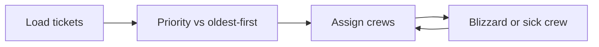

# Sponsor Case Template - IEEE YP Industry Hackathon

**Event:** Autonomous Intelligence for Industrial Innovation
**Dates:** October 2-4, 2026 | Collision Space, Hunter Hub, University of Calgary
**Hosted by:** IEEE Southern Alberta Section Young Professionals
**Contact / send completed cases to:** Subramanian Narayanan, IEEE SAS YP Chair - [nagusubra@ieee.org](mailto:nagusubra@ieee.org)

> **Dear sponsor - thank you for building a case with us.**
> This is the **only file you need to fill in**. One filled copy = one case.
> Creating 2-3 cases? Copy this file per case (see Section 0) or copy Sections 3-12 inside one reply - whichever is easier.
>
> **Time to fill:** about 45-60 minutes per case. Fields marked **(required)** must be completed.
> Write so a **first-year university student from any major** can understand it on first read
> (no unexplained jargon - define everything in Section 10).
>
> **New here?** Skim one live example first (5 min each):
> - [Case 1 - When should we use electricity in Alberta?](01-energy-and-infrastructure-systems/Case%201%20-%20Autonomous%20Alberta%20Peak-Price%20Load-Shift%20Agent/README.md)
> - [Case 1 - Who should 311 send next?](02-software-and-computational-math/Case%201%20-%20Autonomous%20311%20Work-Order%20Dispatch%20Agent/README.md)
> - [Case 1 - Which battery material is good enough for Alberta storage?](03-chemical-systems-and-material-science/Case%201%20-%20Autonomous%20Alberta%20Storage%20Cathode%20Shortlist%20Agent/README.md)
>
> Full scoring rules: [JUDGING_RUBRIC.md](JUDGING_RUBRIC.md) | Rules: [RULES.md](RULES.md)

---

## How to deliver your case - pick A or B (required)

> Everything you send must be **ready to ship to this GitHub repo** with no rework.
> That means: correct folder names, runnable starter code, and **actual data files included** (not just links).

**Option A - Email us a single folder (recommended, easiest for sponsors)**

1. Create one folder per case, named exactly like this:
   `Case N - <Your Case Name> Agent/` - e.g. `Case 1 - Pump Inspection Ranking Agent/`
2. Inside each folder put: this filled template (as `SPONSOR_CASE.md`), your `data/` files,
   any screenshots / video links / extra docs (see layout in Appendix A).
3. Zip the folder(s) and email to [nagusubra@ieee.org](mailto:nagusubra@ieee.org)
   with subject `Sponsor Case: [Your Stream / Case Name]`. We merge it into the repo.

**Option B - Push directly to GitHub (for sponsors with git access)**

1. Fork / branch this repo, add your folder(s) under the right stream folder
   (or a new `04-<your-stream-slug>/` folder if you coined a new stream - see Section 2).
2. Follow the exact layout in Appendix A so judges can run it without asking questions.
3. Open a Pull Request titled `Sponsor case: [Stream] - [Case Name]` and tag `nagusubra`.

> Either way, **attach the data files themselves**. A link-only case will be sent back for revision
> unless there is a hard licensing reason (see Section 8).

---

## 0. Case identity (required)

> **Creating multiple cases?** Fill in one Section 0 per case. Then repeat Sections 3-12 per case
> (copy-paste the block - each case needs its own problem, data, baseline, and scoring).

| Field | Your answer |
|---|---|
| **Case name** (required - short question form) | e.g. `Which pumps should we inspect first?` |
| **Case folder name** (required - exact GitHub name) | e.g. `Case 1 - Pump Inspection Ranking Agent` |
| **One-line tagline** (required, max 140 chars) | e.g. `Rank 200 pumps by failure risk so one crew fixes the right 20 first.` |
| **Sponsor organization** (required) | e.g. `Acme Water Services` |
| **Stream** | [ ] Fits existing stream (Section 2, pick 1-3) \| [ ] New stream we coin below |
| **New stream name** (only if no existing field fits) | e.g. `04-robotics-and-field-operations` + display title `Robotics and Field Operations` - *you coin it, we create the folder* |
| **Case number in that stream** | e.g. `Case 1 of 2 in our new stream` |
| **Desired difficulty** | [ ] Beginner-friendly (first-year can finish) \| [ ] Intermediate \| [ ] Advanced |
| **Draft status** | [ ] Idea only - please co-design with us \| [ ] Draft ready for review \| [ ] Final, ship-ready |

> Title rule: a **question a front-line operator would ask**. Good: "Which mains should we repair first?"
> Avoid: "AI-powered synergistic water platform."

---

## 1. Sponsor and mentor info (required)

| Field | Your answer |
|---|---|
| **Company / team name** | |
| **Public link** (logo + 1-paragraph blurb we may publish) | Link: <br>Blurb (max 80 words): |
| **Primary contact** (name, role, email) | |
| **Hackathon-weekend mentor** (name + availability Sat/Sun) | e.g. `Priya S., Sat 10am-2pm MDT, Slack + on-site` |
| **Prize / perk you will offer** (optional) | e.g. `$250 sponsor prize + coffee chats / internships / API credits` |
| **Brand and IP notes** | [ ] We allow use of our name/logo in the case folder \| [ ] Please keep us anonymous (`Sponsor X`) |

---

## 2. Stream fit (required - pick exactly one per case)

> Teams of 2-5 pick **one** stream and solve **one** case in 48 hours.

- [ ] **1. Energy and Infrastructure Systems** - *Alberta power is cheap some hours and very expensive in others. Calgary must decide which building, road, light, water main, or permit file to fix first.*
- [ ] **2. Software and Computational Math** - *Too few crews, trucks, and hours - including hail, smoke, wildfire, and age-assurance flags. Build a schedule, dispatch list, flag list, route, or classifier that still works when something breaks.*
- [ ] **3. Chemical Systems and Material Science** - *Pick a mix, metal, or water sample that is strong enough, clean enough, and cheap enough - against a number (strength, voltage, or a legal limit).*
- [ ] **4. New stream - we coin the name.** Fill this in:
  - **Proposed stream folder slug:** `04-` + short-kebab-case, e.g. `04-robotics-and-field-operations`
  - **Proposed display title:** e.g. `Robotics and Field Operations`
  - **Theme in 2-3 sentences (first-year readable):**
  - **Why existing streams don't fit (1-2 sentences):**

**Why this fit (2-3 sentences, required):**

---

## 3. The problem in plain words (required)

> **First-year test:** a first-year student from *any* major (arts, biology, business...)
> must understand the problem without Googling. Short sentences. No jargon unless defined in Section 10.
> Cover the **5 Ws** (who / what / when+where / why-it-matters) and **current state to desired future state**.
> Aim for 150-350 words. This becomes the `## The problem` section of the live case.

### 3a. Context (who cares, what hurts today)

<!-- Who is affected? Where/when does it happen? How big is the pain - attach a number if you can (dollars, hours, failures, complaints)? -->

**Current / status-quo behaviour:**

**Why it matters (money, safety, time, environment - pick 1-2):**

### 3b. Challenge statement (what teams must build in 48 hours)

<!-- One paragraph, outcome-based. Say WHAT to achieve, not HOW. Must imply: read real data, make a plan, score it, revise once. -->

> Example: *"Read hourly prices. Make a plan for when to use power. Compare the bill to 'always on.' Then change the rule once and show whether the bill got better."*

**Your challenge (3-5 sentences):**

### 3c. Out of scope (to keep it solvable in 48 hours)

<!-- List 2-4 things teams should NOT attempt (e.g. full city routing, real-time control, CFD simulation). -->

- NOT in scope:
- NOT in scope:
- NOT in scope:

---

## 4. Who would use this - business value (required)

| Field | Your answer |
|---|---|
| **End user** (job title + org) | e.g. `City energy manager / plant operator / 311 supervisor` |
| **Decision they make with the output** | e.g. `Which 20 of 200 pumps to inspect this week` |
| **Value proposition** (one sentence) | e.g. `Same work, cheaper - by shifting WHEN it happens.` |
| **Path to real deployment** (2-3 bullets) | e.g. `Pilot on one facility, integrate with work-order system, scale to fleet` |

> Judges award 15/100 pts for *Practical Application / Commercialization* - this section is what they score.

---

## 5. The task - 5 steps teams follow (required)

> Give **exactly 4-6 numbered steps** a team can finish in a weekend. One step must be *"beat the baseline"*
> and the next must be *"change one thing and re-score."* Use the live cases as a model.

1. **Load:** <!-- file + key columns / sheets / fields to keep -->
2. **Plan (v1):** <!-- the rule / score / ranking teams build first -->
3. **Baseline:** <!-- the lazy plan they must beat - see Section 7 -->
4. **Revise (v2):** <!-- the ONE disruption, filter change, or cutoff change they must try -->
5. **Report:** <!-- the 2-3 sentences / numbers they must write down -->

**Stretch goal (optional, only if teams finish early):**

---

## 6. Picture of the loop (required - we will draw it if you describe it)

> Every case is an **autonomous agent loop**: `data -> plan -> score -> revise`. Describe yours in 3-5 boxes and we will render the Mermaid flowchart.

```text
[Your boxes here, e.g.: Load tickets -> Priority vs oldest-first -> Assign crews -> Blizzard or sick crew -> (back to Assign) ]
```

<details>
<summary>Example Mermaid snippet (organizers will paste this into the case README)</summary>



</details>

---

## 7. Naive baseline to beat (required)

> The "lazy plan" every team must outperform in code. Pick one. This keeps judging fair across Option A and Option B.

| Pick one | Baseline | When to use it |
|---|---|---|
| [ ] | **Always-on / yesterday's value / random / majority-class** | Forecasting, flagging, classification |
| [ ] | **Oldest-first (FIFO)** | Queues, permits, work orders, dispatch |
| [ ] | **Nearest-neighbour / shortest-first** | Routing, assignment |
| [ ] | **Sort by one column only** (e.g. energy-only, cheapest-first) | Ranking / shortlisting |
| [ ] | **Other (describe):** | |

**Baseline definition (one sentence, required):**

**Primary metric teams report (pick 1-2):** [ ] dollars saved | [ ] hours moved | [ ] percent jobs moved | [ ] coverage / recall | [ ] overlap vs baseline | [ ] Other: ____

---

## 8. Data - attach the actual files (required)

> **Strong preference order - please follow it:**
> 1. **Best: attach actual files** - real, de-identified sponsor data in `data/` (any format below).
> 2. **Great: attach synthetic data** you generated to mimic the real thing.
> 3. **Good: attach a sliced sample** of a public dataset (cleaned, max 10 MB total).
> 4. **Last resort only: a link** to an online dataset. Links rot, need logins, and stall teams for hours -
>    use only if licensing forbids redistribution, and then include a tiny working sample + exact download steps + a fallback mirror.
>
> **Formats welcome (not CSV-only):** `.csv` | `.json` / `.jsonl` | Excel (`.xlsx`, one data sheet + one `README` sheet)
> | `.txt` / `.md` / `.log` | images (`.png` / `.jpg`, max 2 MB each) | any other small open format.
> Keep the **whole `data/` folder at max 10 MB** so it ships cleanly to GitHub. Larger raw files go in `data/raw/` (gitignored) with download steps.
> No logins, no paywalls, no PII / secrets - submissions are public (see Section 13).

### 8a. Files you attach (list every file - add rows as needed)

| # | Filename + format | What it is (1 line) | Approx. size / rows | Source: real / synthetic / public-slice |
|---|---|---|---|---|
| 1 | e.g. `pump_readings_2024.csv` | `Pressure + flow per pump per hour` | `about 500 rows x 8 cols` | `Real, de-identified` |
| 2 | e.g. `pump_photos/` (12 x `.jpg`) | `Nameplate + corrosion photos` | `about 6 MB` | `Real` |
| 3 | e.g. `failure_codes.xlsx` | `Code to meaning lookup` | `about 40 rows` | `Synthetic` |
| | | | | |

**Key columns / sheets / fields teams must use (per file):**

**Known quirks teams must handle (missing values, encodings, image sizes...):**

<!-- e.g. Missing pressure on 3 percent of rows - teams must drop or impute and say so. -->

### 8b. Provenance - where each file came from (required per file)

| File | Publisher / system it came from | Licence / terms | Citation line | If link-only: exact download steps + mirror |
|---|---|---|---|---|
| e.g. `pump_readings_2024.csv` | `Acme SCADA export, Jan-Jun 2024` | `Sponsor grants hackathon reuse (see Section 1 IP)` | `Acme Water Services. Pump readings sample, 2024.` | `n/a - file attached` |
| | | | | |

> Good public pools if you slice a sample: [Open Calgary](https://data.calgary.ca/),
> [AESO data requests](https://www.aeso.ca/market/market-and-system-reporting/data-requests/),
> Alberta Open Government, ECCC, CER, Statistics Canada.

### 8c. (If synthetic) Generation spec

<!-- Ranges, distributions, planted pattern, and random seed. Keep it reproducible: numpy seed = 42. Attach the generator script too if you have one. -->

- Columns / fields + ranges:
- Planted signal (what a good agent should find):
- Seed / generator script filename in your folder:

### 8d. (Only if you truly have NO data) Desired output + ideal input

> No data? You must still give teams a target to hit. Attach **both** items below -
> otherwise organizers cannot accept the case.

- [ ] **Desired output state (screenshots / mock):** attach 1-3 images in `screenshots/` showing
  exactly what "good" looks like (e.g. ranked table, flagged map, dashboard, alert).
  For each image, write one caption: *what am I looking at + what counts as correct.*
  - `screenshots/output_1.png` - caption:
  - `screenshots/output_2.png` - caption:
- [ ] **Ideal input sketch:** describe (or mock up as a 5-10 row CSV/JSON) what perfect input rows
  would look like - field names, types, example values, and how often they arrive.
  - Filename in your folder:
  - Fields + example row:

---

## 9. Starter code spec (required - organizers implement from this, or you include it)

> Every ship-ready case includes `agent_starter.py` (about 30-60 lines) + `requirements.txt`
> that runs with **Python 3.10+ (3.11 recommended)** via:
> `pip install -r requirements.txt` then `python agent_starter.py`.
> You describe the behaviour; we write the code - or include your own script (even better for ship-readiness).
> Keep dependencies to `pandas numpy scikit-learn` (+ `openpyxl` for Excel, `pillow` for images) unless you justify more.
> Must handle **your actual formats in Section 8** (CSV and/or JSON / Excel / text / images).

| Field | Your answer |
|---|---|
| **Script behaviour (3-5 bullets)** | e.g. `Load CSV, train/test split by date, print always-on bill vs p90 rule vs revised p80 rule` |
| **The ONE number teams change first** | e.g. `quantile 0.90 to 0.80, or crew count C = 3 to 2` |
| **Expected console output (paste 4-6 lines)** | |
| **How it reads non-CSV inputs** (if any) | e.g. `openpyxl reads failure_codes.xlsx Sheet1; PIL thumbnails pump_photos/` |
| **Extra packages beyond pandas/numpy/sklearn** | [ ] None \| [ ] `openpyxl` (Excel) \| [ ] `pillow` (images) \| [ ] Other (justify + pin version): |
| **Runs without API key / internet?** | [ ] Yes (required default) \| [ ] No - needs key (explain): |
| **You attach your own starter?** | [ ] No - please write it from this spec \| [ ] Yes: filename in folder: |

---

## 10. New words - glossary (3-6 terms, required)

> Define every jargon word a first-year student wouldn't know, in a `| Word | Meaning |` table.

| Word | Meaning (one line, plain words) |
|---|---|
| e.g. `Pool price` | `Alberta's hourly wholesale electricity price (dollars per MWh)` |
| | |
| | |
| | |

---

## 11. Videos, links and additional info (2-5 items; at least one video or visual strongly encouraged)

> Public links only (YouTube/Loom, docs, simple explainers, Wikipedia). No textbooks, no logins.
> Mark which are **required viewing** (max 5 min) vs optional. Attach any PDFs/images in `extras/`.

- [Video] [Title - 3:24 video](URL) - *required / optional - why it helps (max 10 words)*
- [Title - source](URL) - *required / optional - why it helps*
- [Title - source](URL) - *required / optional - why it helps*
- `extras/` attachments in your folder (list filenames):

---

## 12. How we score this case (required)

> Judges use the shared [JUDGING_RUBRIC.md](JUDGING_RUBRIC.md) (100 pts). Add **3-4 case-specific targets** so mentors and judges know what "good" looks like. Must include baseline + loop.

| What we look for | Target (concrete, measurable) |
|---|---|
| Baseline | e.g. `Oldest-first for the same crew capacity` |
| Your plan | e.g. `Higher priority points, or better safety-type coverage` |
| Loop / revision | e.g. `One disruption; report percent of jobs that moved` |
| Honesty / size guardrail | e.g. `Sample of 80-200 tickets, not all of 311 history` |

**Anything judges should penalize (1-2 bullets):**

<!-- e.g. hardcoded answers, fully mocked demo, single chat answer with no code loop -->

---

## 13. Guardrails - feasibility, ethics, privacy (required)

| Check | Confirm / explain |
|---|---|
| **48-hour feasible?** (a competent team reaches v2 in about 8-12 hrs) | [ ] Yes - we piloted / estimated | Notes: |
| **First-year readable?** (read Section 3 aloud to a non-major) | [ ] Yes | Notes: |
| **No private / personal data?** (submissions are public; no secrets in repos) | [ ] No PII / credentials in files \| [ ] Needs anonymization (explain): |
| **Safety / dual-use?** | [ ] Benign \| [ ] Needs disclaimer (explain): |
| **Physical / legal constraint included?** (budget, time, voltage, legal limit...) | Constraint: |
| **Accessibility** (colour-blind-safe plots, plain language) | [ ] Will follow starter-code defaults |

---

## 14. Ship-ready checklist - before you hit send (required)

> Your folder must arrive in this shape so we can merge it into this repo with zero rework.
> See Appendix A for the exact tree.

- [ ] Folder named `Case N - <Case Name> Agent/` (repeat per case; new stream goes under `04-<your-slug>/`)
- [ ] This template filled in, saved as `SPONSOR_CASE.md` inside the folder
- [ ] `data/` contains the **actual files** (Section 8a) - total max 10 MB; large raw in `data/raw/` (gitignored) with steps
- [ ] Non-CSV formats load from starter spec (Section 9); Excel has a `README` sheet; images max 2 MB each
- [ ] If no data: `screenshots/` (desired output) + ideal-input mock are included (Section 8d)
- [ ] `extras/` holds any videos-as-files, PDFs, docs referenced in Section 11 (links alone are not enough for offline hacking)
- [ ] Starter script behaviour + expected output filled in (Section 9), or your own `agent_starter.py` attached
- [ ] Problem text passes the **first-year read-aloud test** (Section 3)
- [ ] No PII, secrets, API keys, or unlicensed data anywhere in the folder

---

## 15. Logistics - what you provide at the event (optional but appreciated)

- [ ] Mentor on-site or on-call (Sat/Sun hours in Section 1)
- [ ] 5-min kickoff lightning talk (Fri Oct 2, 5 PM)
- [ ] Docs / API / sample hardware access (describe + licence):
- [ ] Sponsor prize judging (who decides + criteria):

---

## 16. Organizer checklist (for IEEE team - sponsors may ignore)

- [ ] Data files committed to `data/` (max 10 MB); larger raw in `data/raw/` (gitignored)
- [ ] `data/README.md` written (file table for **all formats** + source + loading snippet per format + citation)
- [ ] `agent_starter.py` runs clean on Python 3.11 (handles CSV/JSON/Excel/text/images per Section 8)
- [ ] `requirements.txt` pinned to major versions
- [ ] Case `README.md` follows live-case order: problem, who-uses, steps, loop diagram, glossary, videos/links, scoring, start-here
- [ ] Mermaid flowchart renders on GitHub
- [ ] New stream folder (`04-<slug>/`) created if coined; linked from root `README.md` stream table + `REGISTRATION.md`
- [ ] Feasibility pilot timed (starter runs in under 2 min, v2 reachable in a day)

---

## Appendix A - Ship-ready folder layout (copy this tree)

> **Email (Option A):** zip the `Case N - ... Agent/` folder(s) below.
> **GitHub push (Option B):** place them under the stream folder (or your new `04-<slug>/`).

```text
04-your-stream-slug/  (only if you coined a new stream; otherwise use 01/02/03 folder)
+-- Case N - <Your Case Name> Agent/
    +-- SPONSOR_CASE.md        # this filled template (you write)
    +-- README.md              # organizers build from Sections 3-7, 10-12 (or you draft it)
    +-- agent_starter.py       # organizers build from Section 9 (or you attach yours)
    +-- requirements.txt       # pandas>=2.0, numpy>=1.24, scikit-learn>=1.3 (+ openpyxl / pillow if needed)
    +-- data/
    |   +-- README.md          # organizers build from Section 8
    |   +-- <seed>.csv         # and/or .json / .xlsx / .txt / images/ - your ACTUAL files (Section 8a)
    |   +-- raw/               # (optional, gitignored) large raw + download steps
    +-- screenshots/           # (required if Section 8d) desired-output mocks + captions
    +-- extras/                # videos-as-files, PDFs, docs linked in Section 11
```

**Multi-format loading snippets** (`data/README.md` will include the ones you need):

```python
import pandas as pd, json
df = pd.read_csv("data/sample.csv", parse_dates=["timestamp"])   # CSV
recs = [json.loads(line) for line in open("data/sample.jsonl")]  # JSON Lines
xl = pd.read_excel("data/lookup.xlsx", sheet_name="Sheet1")      # Excel (needs openpyxl)
txt = open("data/notes.txt").read().splitlines()                 # TEXT / LOG
from PIL import Image
im = Image.open("data/photos/img01.jpg")                         # IMAGES (needs pillow)
```

## Appendix B - Making multiple cases easy (read this if N is greater than 1)

1. **Coin the stream once** (Section 2): one slug + title + theme for all your cases.
2. **Number cases sequentially:** `Case 1 - ... Agent`, `Case 2 - ... Agent`, ... inside that stream folder.
3. **Reuse Sections 1-2, rewrite Sections 3-12 per case:** each case needs its own problem text, steps, baseline,
   data files, starter spec, glossary, videos, and scoring targets. Shared sponsor info (Section 1) can say
   *"Same as Case 1"* after the first file.
4. **Keep data separate per case:** each case folder has its own `data/` (don't cross-reference).
5. **Keep difficulty laddered:** make Case 1 beginner-friendly (first-year finishable), later cases harder.

## Appendix C - Worked mini-example (delete before submitting)

> **Stream:** existing (01-Energy). **Case:** `Case 9 - Pump Inspection Ranking Agent`
> **Challenge:** *Score 500 break records by diameter, age, and break history. Rank the top 20 for one crew-week. Beat oldest-first. Then apply a freeze-thaw disruption week and re-rank; report percent moved.*
> **Baseline:** oldest break first. **Metric:** breaks avoided per crew-week.
> **Data attached (not linked):** `data/pump_readings_2024.csv` (about 400 rows) + `data/failure_codes.xlsx` (lookup) + `data/photos/` (6 nameplates).
> **No-data fallback example:** `screenshots/ranked_table_mock.png` (*"Top-20 table with risk score - correct = all 5 burst-history pumps in top 10"*) + `ideal_input_5rows.csv`.

---

*Thank you for sponsoring real-world problem solving. Email your zip to [nagusubra@ieee.org](mailto:nagusubra@ieee.org) with subject `Sponsor Case: [Stream / Case Name]`, or open a PR titled `Sponsor case: [Stream] - [Case Name]`. Questions? We are happy to co-draft Sections 5-9 on a 30-min call.*

*IEEE YP Industry Hackathon | [southern-alberta.ieeecanada.org](https://southern-alberta.ieeecanada.org/)*
