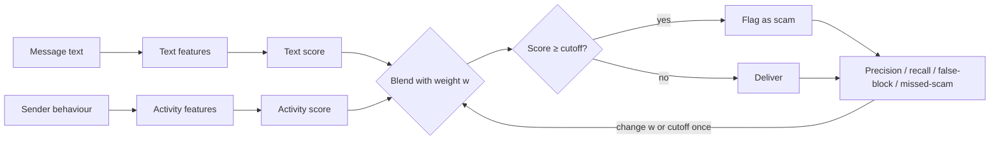

# Case 6 — Is this text a scam? (No blocklist, no clicking the link.)

**Stream:** Software and Computational Math
**Format:** Personal tutorial — system design walkthrough

## The problem (in plain words)

Scam texts are one of the most common ways Canadians get defrauded: fake parcel fees, fake bank alerts, fake tax refunds, "Hi mum, I lost my phone". Canadian carriers let people forward scam texts to **7726** (it spells SPAM), and the Canadian Anti-Fraud Centre collects reports, but by then the message has already landed.

The carrier or messaging app is in a better spot: it sees the message *before* delivery and knows how the sender behaves across the whole network. A single scam number might text 800 strangers in an hour. A real person texts four friends.

Scammers adapt, though. They rotate numbers daily, so a **blocklist** of known-bad numbers is always a step behind. And the carrier can't safely visit every link in real time to check where it goes.

**Your challenge:** You are the engineer on a carrier's messaging-safety team. For each incoming message, decide **scam** vs **legitimate**. You may use the message text and the sender's recent behaviour. You may **not** use a number blocklist, link reputation lookups, or anything the recipient does after delivery. Beat a lazy keyword rule. Then blend in sender behaviour once and show how many scams you catch vs how many real messages you wrongly block.

This estimates risk. It does not prove fraud — the same way a spam folder is a guess, not a verdict.

## Who would use this

A messaging-safety or fraud team at a carrier, a messaging app, or a bank's SMS channel. You are selling a **risk score with an action per band** (deliver / deliver with a warning / hold), and a false-block vs missed-scam trade-off — not a criminal case.

## Steps

1. Load `data/sms_scam_joined.csv` (one row per message: text + sender behaviour + `label_scam`).
2. **Baseline:** flag scam if the text contains prize/urgency keywords (`free`, `win`, `prize`, `claim`, `cash`, `urgent`…).
3. **Text-style score:** build features from the words themselves (has a link, has a dollar amount, uppercase ratio, digit ratio, urgency words, "you/your" rate, has a STOP opt-out). Pick a cutoff.
4. **Blend** that with sender behaviour (account age, messages per hour, share of strangers, reply rate).
5. **Loop:** change the blend weight or the cutoff once. Report precision, recall, false-block rate, missed-scam rate.
6. **Stretch:** train a logistic regression on the same allowed columns. Then ask why it looks *too* good.



**Precision** = of the messages you flagged, how many really were scams.
**Recall** = of the real scams, how many you caught.
Blocking a real message is a **false block**. Letting a scam through is a **missed scam**.

## New words

| Word | Meaning |
|---|---|
| Smishing | Phishing by SMS: a text that tricks you into a link, payment, or reply |
| Blocklist | A list of known-bad numbers or links. Always one step behind |
| Soft signal | A clue (sending rate, word choice) that isn't proof on its own |
| Velocity feature | A count over a time window, like "messages in the last hour" |
| False block | You said scam, but the label says legitimate |
| Missed scam | You said legitimate, but the label says scam |
| Leakage | Using a column the real system wouldn't have at decision time |

---

## The system-design part (the reason this case exists)

The starter script runs in one batch, but in real life this is a service in the message delivery path. Use these prompts to walk from "script" to "system".

### 1. Where each feature comes from

The two feature groups have very different engineering costs, which is the core design lesson.

**Text features are stateless.** They depend only on the message in hand, so any server can compute them in microseconds with no lookups. They scale horizontally for free.

**Behaviour features are stateful.** "Messages this sender sent in the last hour" needs a running counter per sender, updated on every message across the whole network. That usually means a low-latency key-value store with sliding-window counters, keyed by sender. It adds a network hop, a hot-key problem (one scammer blasting 10,000 messages hammers one key), and a freshness question: is a count that's 30 seconds stale good enough?

**`reply_rate_7d` is a slow feature.** It's a 7-day aggregate, so it's computed in a batch job and read from a feature store. It's useless for a brand-new sender (cold start) — which is exactly what scammers are.

### 2. The decision isn't binary in production

A single cutoff is a teaching simplification. Real systems use bands, because the cost of each mistake is different:

- Low score → deliver normally.
- Middle score → deliver with a "possible scam" banner and disable link previews.
- High score → hold, and rate-limit the sender.

Blocking a dentist's reminder or a bank's real fraud alert is a serious harm (false block). Letting "CRA refund" through can cost someone their savings (missed scam). Ask: *which band would you put each message family in, and why?*

### 3. Latency budget

SMS feels instant. If the whole path must add under ~50 ms, where does the time go? Text features: negligible. Counter lookup: a few ms. A heavy text model (a transformer) might not fit, which is one reason simple features plus a linear model are common at the edge, with heavier models running asynchronously on flagged traffic only.

### 4. Feedback loop and labels

Where do labels come from in production? Recipient reports (forwarding to 7726, tapping "Report junk"), analyst review, and confirmed fraud cases. These are delayed, biased (only some people report), and noisy. Ask: how would you retrain without learning "things people bothered to report" instead of "things that are scams"?

### 5. Adversaries adapt

The moment you ship "uppercase ratio" as a feature, scammers stop shouting — the dataset already has ~15% lower-cased scams to show this. Behaviour features are harder to fake (you can't make strangers reply), which is why the blend beats text alone. Ask: which of your features is cheapest for an attacker to change?

### 6. Rollout

Never ship a blocker straight to 100%. Run it in **shadow mode** (score, log, don't act), compare against reports, then start with the warning banner only, then hold the highest band. Keep an appeal path for businesses that get blocked.

---

## What the starter shows (seed 42)

These are the numbers you should see before you change anything, so you can check your setup:

| Model | Precision | Recall | False-block | Missed-scam |
|---|---|---|---|---|
| Keyword rule | 13% | 18% | 17% | 82% |
| Text-style score (cut 1.0) | 54% | 55% | 7% | 45% |
| Blend w=0.5, cut 1.0 | 79% | 75% | 3% | 25% |
| Blend w=0.7, cut 1.0 | 88% | 89% | 2% | 11% |

Run with `--breakdown` and look at *which* families each model misses. The keyword rule catches only prize scams and flags three-quarters of legit marketing. Even the good blend barely catches wrong-number scams — those are slow, polite, link-free, and a real system would need conversation-level signals to find them.

## Honesty (say this out loud when presenting)

The text is fictional templates modelled on the kinds of messages in the public UCI SMS Spam Collection (2011, UK/Singapore SMS). The behaviour columns are synthetic practice data. The logistic regression scores near-perfectly because the generator is simple and the classes are cleanly separated. On real traffic, expect much lower numbers and drift over time.

## Read (optional)

- Almeida, Gómez Hidalgo & Yamakami (2011), *Contributions to the Study of SMS Spam Filtering: New Collection and Results*, ACM DocEng.
- UCI Machine Learning Repository — SMS Spam Collection: https://archive.ics.uci.edu/dataset/228/sms+spam+collection
- Canadian Anti-Fraud Centre — guidance on reporting scam texts and calls.

## How to judge your own work

| What to look for | Target |
|---|---|
| Baseline | Keyword rule, with its numbers |
| Your model | Text style and/or sender behaviour |
| Loop | Change the weight or cutoff once; report all four metrics before and after |
| Per-family view | Name one scam family you still miss and why |
| System design | Say which features are stateless, stateful, or batch, and what that costs |
| Honesty | Text is fictional; behaviour is synthetic; logreg is too good to be true |

## Start here

```bash
pip install -r requirements.txt
python agent_starter.py                      # text only (weight 0)
python agent_starter.py --weight 0.5         # blend in behaviour
python agent_starter.py --weight 0.5 --cutoff 1.3 --breakdown
python agent_starter.py --logreg             # stretch
python tools/make_dataset.py --seed 7        # regenerate with a new seed
```

Python 3.10+.
