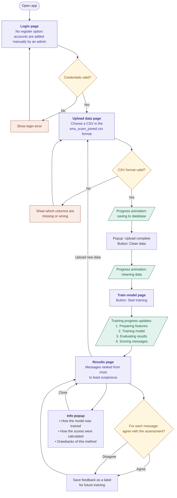

# Software Design Document (SDD)

## 1. Introduction
- **Purpose (Problem Statement)**: [Describe the purpose of this document. E.g., to define the design of the XYZ system.]
    Scam texts are one of the most common ways Canadians get defrauded: fake parcel fees, fake bank alerts, fake tax refunds, "Hi mum, I lost my phone". Canadian carriers let people forward scam texts to 7726 (it spells SPAM), and the Canadian Anti-Fraud Centre collects reports, but by then the message has already landed.
    
- **Scope (include who this is for as well)** : 
  - Is built for people who get the data for sms applications. Will be built like an web app specifically for them
  - Our system estimates lieklihood a text is a scam, not actually telling if its a scam or not
  - Only specififc authorized indiivduals will use this applicaiton, so may make sense to make this application a desktop app instead of a web app, however the framework wil need to be web based, based on my own competnecies.
- **References**: CASE.md

---

## 2. System Overview
- **System Description**: [High-level overview of the system.]
  Will be a fullstack desktop application, with a frontend, a backend, 
  a 3rd party database for storing user login information, alongside handling auth and security.
- **Design Goals**: [E.g., scalability, maintainability, security.]
  The applicaiton should prioritize security and scalability as the number of scam calls will only increase
  and that this algorithimn should not ever be released as any malicous intruder could now see how we detect scam calls
  and adjust their scams accordingly.  
- **Architecture Summary**: [Monolith, microservices, serverless, etc.]
   Our Architecture will be monlithic for now, since it is only one person developing this project, only one codebase 
   needed. May effect scabillity in the future, but for the purposes of this project should be fine.
- **System Context Diagram**:
 ```mermaid
flowchart TB
    U([User]) --> F["<b>Desktop app</b><br/>Frontend: what users see"]
    F -->|1. Log in| A["<b>Auth provider</b><br/>Third-party login + user DB"]
    F -->|2. Request + token| B

    subgraph S["Server side: detection logic never ships to the desktop app"]
        B["<b>Backend (monolith)</b><br/>API · Feature extraction<br/>Scoring model (private)"]
        D[("<b>App database</b><br/>Messages, scores, sender stats")]
        B -->|4. Read/write| D
    end

    B -->|3. Verify token| A

    classDef app fill:#EEEDFB,stroke:#5B4FC4,color:#3B2F8F
    classDef identity fill:#E1F3EC,stroke:#1F6B4E,color:#0E5A3E
    classDef user fill:#F1EEE8,stroke:#5a5a5a,color:#3d3d3d
    class F,B,D app
    class A identity
    class U user
    style S fill:none,stroke:#9a9a9a,stroke-dasharray:6 4
```

## 3. Detailed Backend Design (logic inlcude your machine learning algorithim in here as well)
For each module/component:

### [Component Name]
- **Responsibilities**: [What does it do?]
  The desktop app takes text messages that we manually input and checks whether
  any of them are likely scams. Each message receives a risk score and a label
  (deliver, warn, or hold) based on two key indicators, alongside supporting signals:

  - **Money:** the message mentions money, a reward, or a payment in some form
    ($12.23, $1,000, $300/day, "refund", "fee", "e-transfer"), especially when
    paired with a link or a request to act (pay, claim, verify). Money alone is
    not suspicious, since legitimate bills and purchase alerts contain exact
    amounts too.
  - **Repetition:** one sender sends near-identical text to many different
    recipients, particularly recipients who don't have the sender saved,
    from a new number, with few or no replies. Legitimate businesses also send
    bulk messages, but from long-standing senders with an opt-out ("Reply STOP").

  These indicators raise the risk score but are not strict requirements. A
  message can be flagged without both (e.g. "Hi mum, new number" scams contain
  no money), and a message with both can still be legitimate (e.g. a bill
  reminder sent to every customer). The final decision comes from the ML model
  weighing all signals together, not from a fixed checklist.
- **Interfaces/API Functions** [List out functions and then give a description of the function]:
  **Auth**
    All endpoints require a valid session token from the auth provider.
  Admin-only endpoints also check the user's role.
  - /auth/login [POST]
    - Passes the user's credentials to the third-party auth provider. On success,
      returns a session token to the frontend.
  - /auth/logout [POST]
    - Ends the user's session and invalidates their token.
  - /auth/me [GET]
    - Returns the current user's name and role (user or admin), so the frontend
      knows which features to show.

  **Datasets**
  - /datasets [POST]
    - Uploads a CSV of text messages. Each row must include the message text,
      sender number and timestamp. Returns a dataset ID.
  - /datasets [GET]
    - Lists uploaded datasets with their upload date and row count.
  - /datasets/{id}/clean [POST]
    - Cleans the uploaded data (removes blank or duplicate rows, standardises
      formats) so it can be used for training and scoring.
  - /datasets/{id} [PUT] (admin only)
    - Replaces a stored dataset with a corrected version.
  - /datasets/{id} [DELETE] (admin only)
    - Deletes a stored dataset.

  **Model**
  - /models/train [POST] (admin only)
    - Starts training a model on a cleaned, labelled dataset. Runs in the
      background and returns a job ID.
  - /models/train/{jobId} [GET]
    - Returns the training job's status (running, finished, failed) and, when
      finished, its precision, recall, false-block and missed-scam rates.
  - /models [GET]
    - Lists trained models and marks which one is currently in use.

  **Scoring**
  - /score [POST]
    - Scores new messages with the current model. Each message gets a risk
      score and a label (deliver, warn, or hold) based on money indicators,
      repetition across recipients, and supporting signals.
  - /results/{datasetId} [GET]
    - Returns the scoring results for a dataset to display in the frontend.
  - /results/{messageId}/feedback [POST]
    - Lets a user mark a result as wrong (missed scam or false block). Feedback
      is stored as labels for future retraining.
   
- **Algorithms/Logic**: [Design patterns or important logic.]
    **Model 1: Logistic regression (baseline).**
Adds up each feature times a learned weight, then turns the total into a
probability. Fast, and each weight shows how much a signal matters, which
makes results easy to explain.

**Model 2: Gradient-boosted decision trees (main model).**
Builds many small decision trees, each one correcting the mistakes of the
ones before it. Unlike logistic regression, it learns *combinations*, e.g.
"money + link + new sender = scam" but "money + old sender + opt-out =
legitimate bill". Standard choice for table-shaped data like this.

**Training and evaluation:**
- Hold out ~30% of labelled messages for testing.
- Scams are rare (~13%), so weight the scam class more heavily and judge
  the model on precision, recall, false-block rate and missed-scam rate,
  not accuracy.
- Keep the hand rule as the baseline to beat.

**Decision:** the probability maps to an action band:
low → deliver; medium → deliver with a warning; high → hold.
Cutoffs are set by weighing a blocked real message against a missed scam.

**Maintenance and security:**
- Retrain regularly, since scammers change tactics once they're caught.
- The model and its cutoffs live only on the backend; the desktop app
  receives the risk score, never the detection logic.

---

## 4. Database Design (Tables you will want for your project)
- **ER Diagram / Schema Diagram**:
  - *Use Mermaid / SVG diagram here.*
- **Tables/Collections**: [Define each with fields and constraints.]
  - Tables will be in 2 different places the ones tabbed below this one will be hosted on a 3rd party db so that things like auth and security can be handled much more smoothly then if I were to implement manually. Sacrifice scalability, but worth since not that many users will have access to this desktop app 
    - Users (3rd party)
      - contains a table with username, password that is hashed, ID. 
    - Access (3rd party)
      - Contains user access with the same username and ID as in /Users, alongside priveleges/
    - StoreDataRaw (local)
      - Contains the userData that needs to be cleaned. Contains all Cols in CSV file (message_id,text,sender_account_age_days,msgs_sent_last_hour,unique_recipients_24h,pct_recipients_not_in_contacts,reply_rate_7d,sent_hour,label_scam,message_family)
    - StoreDataCleaned (local)
      - Contains the cleaned data, and avialable for comparison, ensuring it proplery cleaned the csv file for training. Will contain same Cols as Raw, just with data cleaned.
    - ScoredData (Local)
      - Contain the ID, text msg and likelihood of being scam score, is stored after data is trained. 
    - DataValidity
      - Contains the ID, text msg, and a boolean value, checking whether or not the trained data got the text as a scam correct or not, and can be used as information for retraining the model.
- **Relationships**: [Describe relationships between entities.]
  - Users and Access must be related by having the IDs match and be updated whenever a user 

---

## 5. External Interfaces (3rd Party APIS)
- **External APIs**: [Integrations and dependencies.]
  - Will be using a 3rd party api to handle auth, and security for users.
- **Network Protocols/Communication**:
  - [REST, GraphQL, gRPC, WebSockets, etc.]
    - Will Be using rest APIS for the backend

---

## 6. Security Considerations
- **Authentication**: [Method used.]
  - Handled by 3rd party cloud DB
- **Authorization**: [Role/permission models.]
  - Roles stored in table Also in 3rd party cloud DB
- **Data Protection**: [Encryption, storage.]
  - Password must be hashed in the backend . Use Argon2id to do the hashing.
---

## 7. Frontend/ UX Deisgn
- **UX Design**: [Mock ups for your frontend (note that they either must SVG files or html code for opencode to see them)]
  - Look at the ai_desing_mockup for how I want the applicaiton to look like.
- **Frontend Design (What goes where)**:
  - Will first start at the login page, there will be no register page as the users will be manually added for security purposes.
  - Afterwards will go to a train data page, where user uploads CSV file in foramt of sms_scam_joined.csv. Should have animation for showing progress for saving to db.
  - After that is succcessful, a popup will say it has bene completed, and then a button ot ask the user ot clean data, showing similair animation for it to clean the data.
  - Should thne take you to a train data page, that allows the user ot train on the data, and give the user updates as to what stage of trainng has occured.
  - Once training is done, users should get a list, starting with the most suspicious to least suscipous texyt, and a button beside it to be whether or not we agree with the assessment. Also should have an info box that users can click on, whihc iwll show a popup explaining how the data was trained and how the results came to be, as well as some drawbacks of using this method ot find scam messages.
  - Once done, have a way for users to go back to the upload data section for users to be able to upload and trian new data, to see if the results are the same or different.


---

## 8. Tech Stack choices
- **Backend Choice**: [Name of backend framework(s) you will be using and why]
  - The backend will be broken into 2 different backends.
  - Backend 1 which will store user info will be supabase. Not only am I familiilry with the technology, but also it provides ease of use to handle things like auth, row level security and other security functions that I may require. Lacks scalabillity, but that won't be necessary in an application such as this since the number of users accessing this platform is not that high.
  - Backend 2 will be using FastAPI. FAst API is the standard for building AI backends in 2026, and uses a langague I am familair with, that being python. Also can handle client requests + compute heavy pipelines, something we will need for this application.
  - Will also store text data in SQL, using SQL alchey to handle sotrage of data in FAST API. 
- **Frontend Choice**: [Name of frontend framework(s) you will be using (if any) and why]
  - The frontend choice we will be using is electron. Electron is the standard that alot of other companies use for their desktop applicaitons such as discord, but also is a lnaggaue I am familair with since it uses many web based technologies such as react.
- **3rd Party API Choice**: [Name of any 3rd party apis you will be using (if any) and why]
  - Will be using supabase to handle AUTH and RLSS since these are things that cannot necessarily be done by AI cheaply, and is not as important as the training part, so okay to be handled by a 3rd party such as supabase.

---

 
## 9. Testing Strategy (Optional)
- **Unit Testing**: [Tools, coverage goals.]
  - Each endpoint should be tested and ensured that it is working as intended
  - training should als be tested, ensring that a proper output is recieved.
  - Data also needs to be thoroughly cleaned, this must be tested with ebfore and afters in the stored db
- **End-to-End Testing**: [Scope and tools.]
  - Make sure that the flow matches the deisng we have given aobve, both asetically in term of the UX as well as the flow of the frontend website.
  - All funcitons should sufficiently call the backend from the frontend, and no error should occur during that process
---